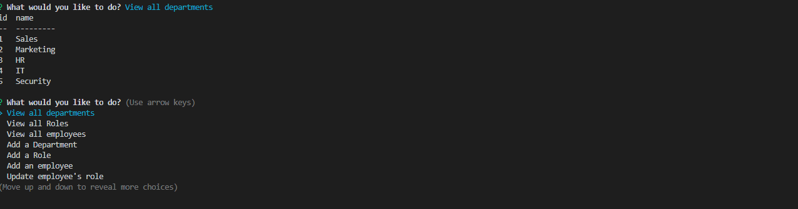
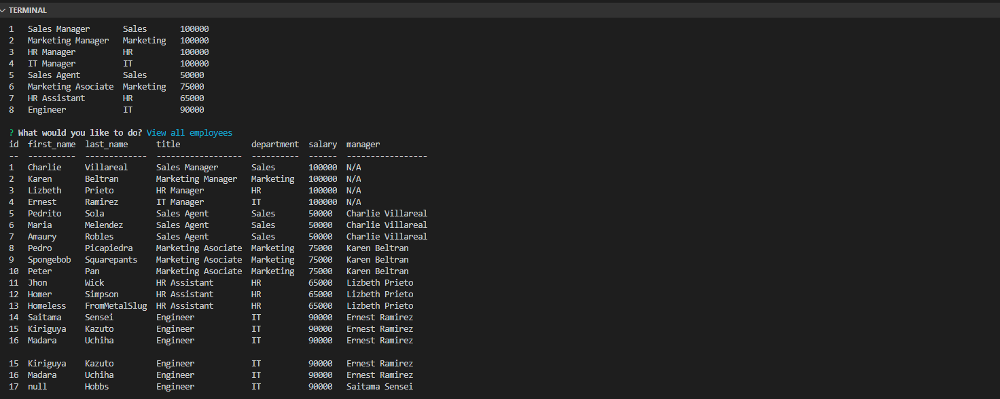

# Employee Tracker

## Description

This is a app based on SQL, that will retrieve a database with specific data in wich you have the options for you to modify somne of the information. Will give different tables for you to have the information you need

## Table of Contents (Optional)

- [Installation](#installation)
- [Usage](#usage)
- [Credits](#credits)
- [License](#license)

## Installation

For you to install you just need to run the "npm i" and later for you to run "node server.js"

## Usage

There is a walkthrough video in a directory called Video and I have some screenshots of this application working

    ```md
    
    
    
    ```

## License

MIT
